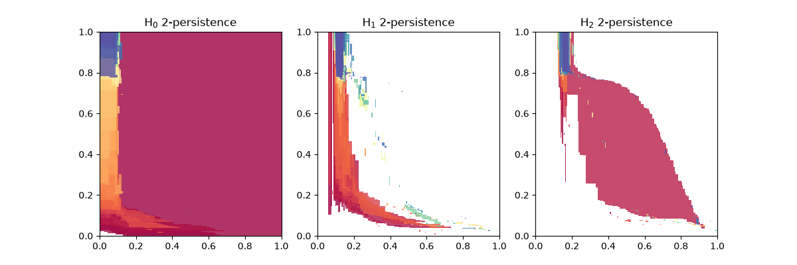

# Sublevel Flood bifiltration: scalable 2-parameter persistent homology

[](https://pypi.org/project/slflood/)

This repository contains the code for the manuscript *Sublevel Flood bifiltration: scalable 2-parameter persistent homology*.
The aim is to provide a way to compute 2-parameter persistent homology of large scale point clouds (up to $10^6$).
To do so, it extends the [*Flood filtration*](https://proceedings.neurips.cc/paper_files/paper/2025/hash/aba03e6f25decb32bda9c5bf81c58305-Abstract-Conference.html) to the 2-parameter context.

The Python package constructs a ```SimplexTreeMulti``` from the [```multipers```](https://github.com/DavidLapous/multipers) library.

## Installation
`slflood` can be installed via PyPI.

```pip install slflood```

## Usage

The following example computes the sublevel Flood bifiltration of a random point set in $\mathbb{R}^3$ with random values and 100 landmarks, using CUDA if available, then computes and plots its multiparameter module approximation with `multipers`. 

```python
import slflood
from slflood.data import noisy_sphere_data

import matplotlib.pyplot as plt
import multipers

n_pts = 10000
n_lms = 100
dim = 3

pts, lms_idx, fun = slflood.data.noisy_sphere_data(n_pts, n_lms, dim,
                                                   bandwidth=0.2)

slf = slflood.slflood_bifiltration(pts.cuda(), lms_idx.cuda(), fun.cuda())
mma = multipers.module_approximation(slf)
mma.plot(box=[[0, 0], [1, 1]])
plt.show()
```



## Citation
```bibtex
@inproceedings{clemot2026sublevel,
      title={The sublevel {Flood} bifiltration: towards scalable 2-parameter persistent homology}, 
      author={Cl{\'e}mot, Matt{\'e}o and Digne, Julie and Tierny, Julien},
      year={2026},
      booktitle={NeurIPS},
}
```